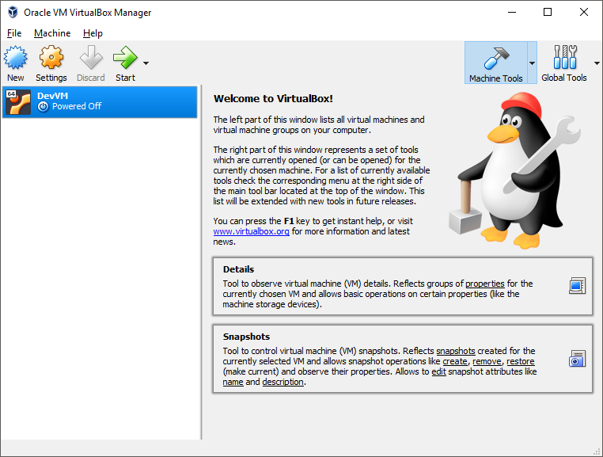
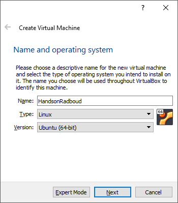
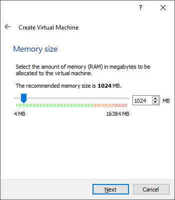
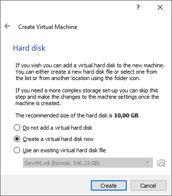

## 1. Aanmaken Virtual Machine

We beginnen met het opzetten van Virtualbox. Zoals de naam al doet vermoeden is Virtualbox software waarmee je een computer kunt virtualiseren. Je kunt hier een ander besturingssysteem in draaien dan je eigen besturingssyteem (het host besturingssysteem.)

Als je Virtualbox opstart krijg je onderstaand scherm te zien (zonder de DevVM erin die er bij mij in staat.) 

 

- [ ] Klik linksboven op new en je krijgt dit scherm te zien

 

- [ ] Bedenk een naam voor je nieuwe VM (virtual machine) en klik op `Next`

 

- [ ] Selecteer hoeveel geheugen van je host machine je wilt gebruiken voor je VM. (2048MB is voldoende, waarschijnlijk lukt het ook wel met 1024MB hoewel het dan wel een stukje trager zal werken)

 

- [ ] Maak een nieuwe virtual disk aan voor je nieuwe VM, zet dit op een plek op je computer waar je voldoende opslag ruimte hebt. 
- [ ] In het volgende scherm kun je `Dynamicly Allocated` selecteren wat er voor zorgt dat niet meteen de volledige 10GB gebruikt wordt op de host machine.
- [ ] Blijf dit doorlopen tot je klaar bent, je kunt overal de default instellingen gebruiken.

:thumbsup: Volgende hoofdstuk [Ubuntu installeren](../install_ubuntu/) :fast_forward: