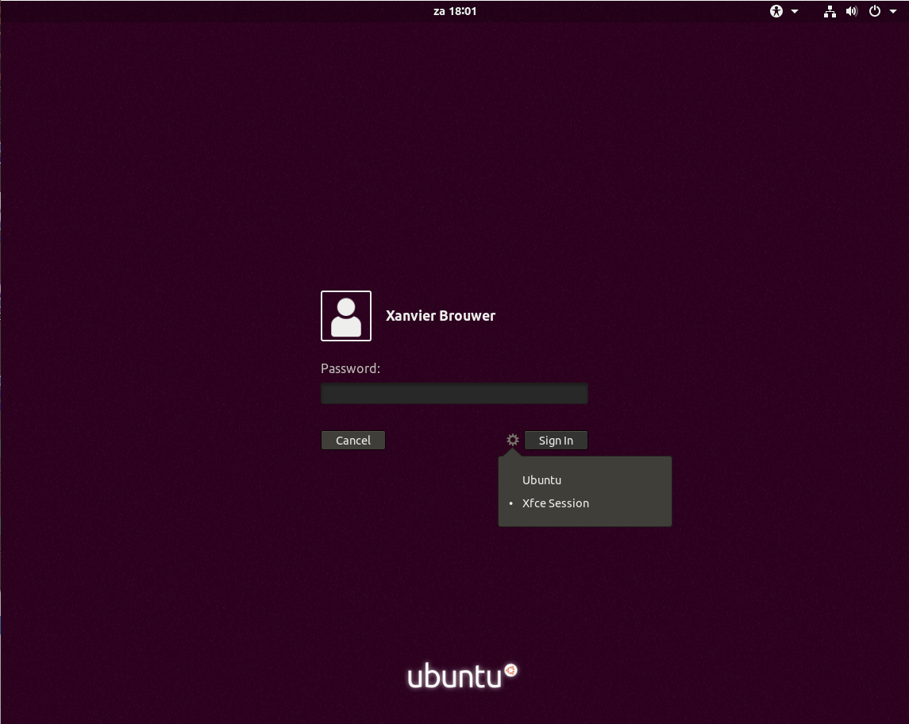

# 7. Desktop environment

Je zit nu in de DE (Desktop Environment) Gnome 3. Het is mogelijk om een andere desktop environment te installeren waardoor het hele besturingssysteem een ander look krijgt. Een andere reden dan een andere look kan ook zijn om een minder zware DE te installeren. Zeker wanneer je gevirtualiseerd draait kun je beter een andere DE draaien dan Gnome 3. 

- Installeer met apt `xfce4`

Het juiste pakket is nu geïnstalleerd. Het probleem is dat Wayland is geactiveerd en daarmee gaat het niet lukken om XFCE op te starten.

- Bewerk als sudo `/etc/gdm3/custom.conf`
- verander de regel `#WaylandEnable=false` naar `WaylandEnable=false` (hekje weghalen)

Herstart nu de VM.

- Log uit
- op het inlog scherm kun je bij het radartje je DE selecteren zoals op het screenshot hieronder

 

- Log in op de omgeving

Zoals je ziet, ziet alles er nu anders uit. Als het goed is, performed dit ook beter dan Gnome 3 omdat het veel minder resources gebruikt.

:thumbsup: Volgende hoofdstuk [Webserver](../webserver/) :fast_forward: