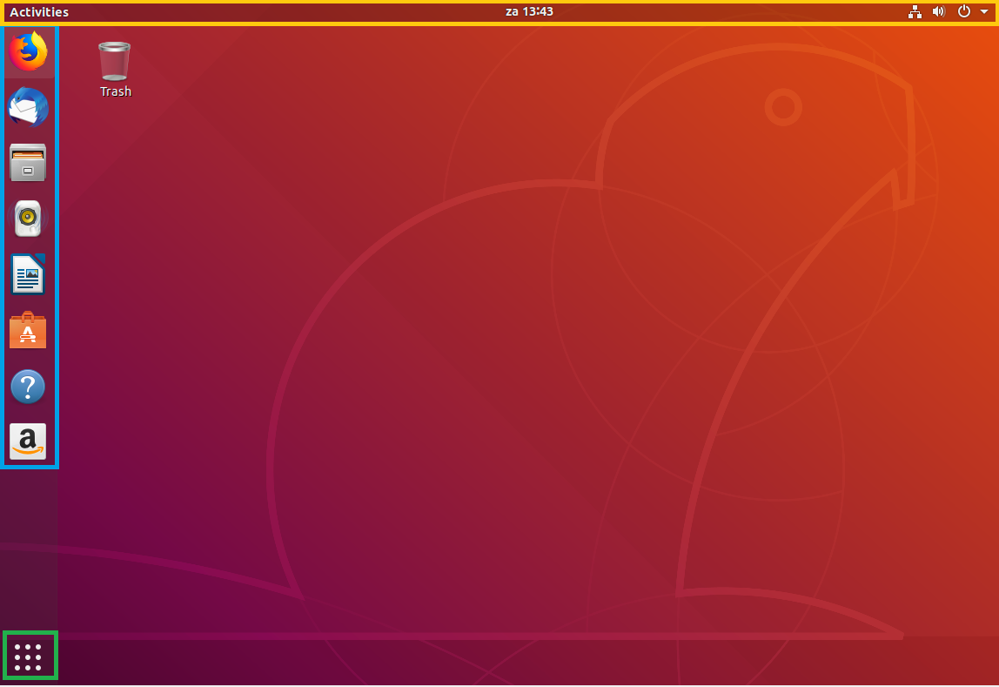
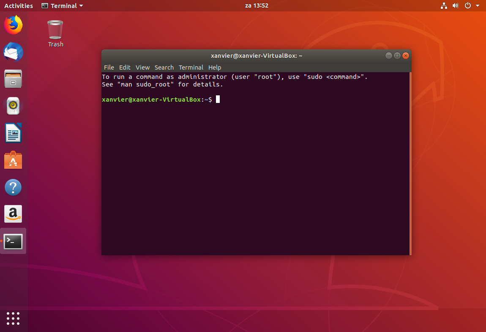

# 3. Eerste kennismaking met Ubuntu

Nu je Ubuntu hebt geïnstalleerd kunnen we echt beginnen met de hands-on sessie. 

## De desktop

In bovenstaande afbeelding zie je dat het is opgedeeld in 3 onderdelen:

1. De met geel aangegeven activity bar. Als je applicaties open hebt staan komen ze hier te staan. Op dezelfde manier als dat de actieve applicaties in Windows in de start-balk komen te staan.
2. De met blauw aangegeven snel-start balk. Hier kun je veelgebruikte applicaties in zetten.
3. De met groen aangegeven applicatie lijst, hier komen alle geïnstalleerde applicaties in te staan.

## Applicaties in de GUI

Er zijn veel applicaties beschikbaar in de snel-start balk aan de linkerzijde. Probeer de webbroweser Firefox en de word-vervanger Libre-office writer eens uit. Je kunt ook in de applicaties lijst kijken wat daar allemaal inzit en eens het een en ander uitproberen.

## installeren van nieuwe software (deel 1)

Als je klikt op het oranje icoontje in de snelstart balk, wordt Ubuntu software geopend, dit is een zogenaamde pakket manager. Vanuit dit scherm kun je kiezen welke pakketen je wilt installeren. Dit is iets dat al jaren in vele Gnu/Linux distributies zit. Dit is pas populair geworden sinds het wordt ondersteund door mobiele telefoons, zoals je de Apple App Store en de Android Play Store. Tegenwoordig zit dit ook in Windows 10 maar is nog niet echt populair onder windows gebruikers.

## De terminal en basis file manipulatie 

> :pushpin: In Gnu/Linux wordt veel gedaan in de command line omdat het zeer krachtig is. Je kunt veel sneller commando's typen dan met de muis door allerlei grafische interfaces gaan. Dit is dus niet een achterhaald systeem en vele developers en operators gebruiken dit nog steeds dagelijks, de hele dag.

- Start nu een **Terminal** op zodat we wat Gnu/Linux commando's kunnen uitvoeren.

- Wanneer je een terminal start, zie je een aantal dingen. In het scherm zelf zie je een melding staan over Sudo, hier komen we later nog op terug. Je ziet (in het groen) de prompt. Deze heeft standaard het formaat `<Huidige gebruiker>@<computernaam>:<Huidig pad>$ ` Uiteraard (zoals eigenlijk alles) kun je dit aanpassen. Maar dat gaat buiten de scope van deze hands-on sessie. 
- Als je een terminal start begin je meestal in je eigen `Home`-directory. Je eigen home directory wordt aangegeven met een `~`. Je kunt altijd het huidige pad opvragen met het commando `pwd`. Voer dat uit en zie wat je huidige pad is.
- Als je nog niet van directory bent veranderd zal het systeem iets teruggeven in de trant van `/home/<username>`
- Om de inhoud van deze map te zien voer je `ls` uit, dit commando "list" de inhoud van de map.
- Je ziet dat er een aantal andere mappen in je home directory zitten. Navigeer nu naar de Desktop met het commando `cd Desktop`. 

> :exclamation: **Tip:** Op veel plaatsen is auto-completion geïmplementeerd. Hiermee hoef je maar een gedeelte van (bijvoorbeeld) de map te typen. Als je `cd Des` intypt en op de tab toets klikt zal het commando worden afgemaakt zonder dat je het hele woord hoeft te typen. Dit scheelt je uiteindelijk veel tijd.

- Je ziet nu dat de prompt is aangepast met het huidige pad. 
- Je kunt een stap omhoog (weer terug naar waar je eerst was) met `cd ..`
- Maak nu een nieuwe map aan met het commando `mkdir test`

je maakt hiermee op de desktop een nieuwe map aan. Zodra je dit hebt uitgevoerd zie je deze map ook meteen staan op de achtergrond. eigenlijk is de naam nu niet goed, je kunt de naam van een map veranderen door middel van het commando `mv` (move). het heeft deze opmaak: `mv <origineel> <doel>`. 

- Hernoem de map naar *handson-quintor*
- `cd` nu in de map die je zojuist hebt aangemaakt

Met het commando `touch <filenaam>` kun je lege bestanden aanmaken. 

- Maak een nieuw bestand aan en kies zelf een naam.

Dit bestand is nu helemaal leeg, laten we er wat tekst in zetten met een tekst editor. Een zeer gebruiksvriendelijke tekst editor die staat geïnstalleerd op Ubuntu is `nano`. Het is vergelijkbaar met Notepad op windows. (maar is wel wat krachtiger)

- Start nano dmv `nano <bestandsnaam>` en type een paar woorden tekst. 

Onderin het scherm kun je zien welke commando's je kunt geven. het dakje staat voor de Control toets op je toetsenbord. 

- Exit het programma en sla je bewerkingen op.

je komt nu weer terug in de command line interface waar je hiervoor ook in zat. Je kunt nu het bestand dat je hebt aangemaakt zien op het scherm met het commando `cat <bestandsnaam>`. 

## installeren van nieuwe software (deel 2)

Zoals eerder aangegeven is het al lange tijd gebruikelijk dat applicaties worden geinstalleerd met pakket managers. Dit wordt veelal nogsteeds met de command line gedaan (omdat het sneller is.) Je kunt gebruik maken van CLI-tool `apt`. Een dergelijke tool werkt met package lists welke worden gespiegeld met online lijsten. 

- Om de pakket lijsten te updaten voer je `apt update` uit. 

Je krijgt nu een foutmelding te zien omdat je gebruiker geen rechten heeft om dit te doen. Dit commando moet worden uitgevoerd door de zogenaamde root gebruiker. Vroeger was er altijd een root gebruiker die alles mag op een Linux-systeem. Om te zorgen dat je hiervoor toch de rechten hebt en niet door allerlei hoepels hoeft te springen om een root-account te krijgen, is er het commando `sudo`. Als jij als gebruiker een sudo-user bent mag je sudo gebuiken om root commando's uit te voeren. Jij bent nu de enige gebruiker en daarmee standaard een sudo gebruiker. Je kunt voor ieder commando `sudo` zetten om het als root uit te voeren.

- Update de lijsten als sudo'er

nu de lijsten geüpdate zijn kun je een pakket installeren. In dit voorbeeld gaan we Chromium installeren maar je kan natuurlijk ook iets anders installeren. Je installeert iets door `apt install <pakketnaam>` uit te voeren (als sudo) en je kunt een specifiek pakket zoeken dmv `apt search <zoekwoord>`.

- Installeer chromium
- Na de installatie start Chromium vanuit de applicatie lijst.

:thumbsup: Volgende hoofdstuk [Gebruikers en rechten](../users/) :fast_forward: